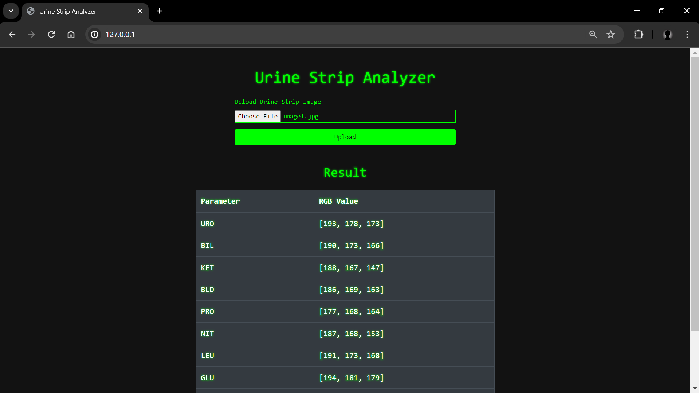

# Urine Strip Analyzer

This project is a web application that allows users to upload an image of their urine strip and receive the color values of each strip segment as JSON. The backend is built with Django, and the image processing is handled using OpenCV.

## Table of Contents

- [Features](#features)
- [Requirements](#requirements)
- [Installation](#installation)
- [Project Structure](#project-structure)
- [Code Explanation](#code-explanation)
- [Screenshots](#screenshots)

## Features

- Upload an image of a urine strip through the web interface.
- Analyze the image using OpenCV to extract the color values of each strip segment.
- Return the results as JSON with RGB values.

## Requirements

- Python 3.x
- Django
- OpenCV

## Installation

1. Create a virtual environment:
```shell
    python -m venv env
```
2. Activate the virual environmanet:
```shell
    source env/bin/activate
```
3. Clone the repository:
```shell
    git clone https://github.com/Sanket-Ugale/UrineStripAnalyzer.git
```

```shell
    cd UrineStripAnalyzer
```
4. Install the required dependencies:

```shell
    pip install -r requirements.txt
```

5. Run the Django development server:
```shell
python manage.py runserver
```
Open your web browser and navigate to ```http://127.0.0.1:8000```

6. Upload an image of the urine strip using the provided form.

7. View the JSON response with the color values of each strip segment.

## Project Structure

``` csharp
urine-strip-analyzer/
│
├── UrineStripAnalyzer/            # Django project directory
│   ├── __init__.py            # Python package initialization
│   ├── asgi.py                # ASGI configuration
│   ├── settings.py            # Django settings
│   ├── urls.py                # URL configuration
│   ├── wsgi.py                # WSGI configuration
│   └── ...
│
├── strip_analyzer/              # Django app directory
│   ├── migrations/            # Database migrations
│   ├── admin.py               # Django admin configuration
│   ├── apps.py                # Django app configuration
│   ├── models.py              # Django models (if any)
│   ├── tests.py               # Django tests
│   ├── urls.py                # App-specific URL configuration
│   ├── views.py               # Django views
│   └── ...
├── templates/             # HTML templates
|   └── home.html         # Upload form template
├── manage.py                  # Django management script
├── README.md                  # Project README file
└── requirements.txt           # Python dependencies

```

## Code Explanation

Backend (Django with OpenCV) Views (```analyzer_app/views.py```):

### analyze_strip: 
Handles the image upload, processes the image, and returns the color values as JSON.
process_image: Uses OpenCV to read the image, divide it into segments, and calculate the average color for each segment.

URLs (```analyzer_app/urls.py```):

Maps the analyze_strip view to the ```/analyze_strip/``` URL.
Frontend (HTML and JavaScript)
HTML (```templates/home.html```):

Provides a form for uploading the image and a script to handle the form submission and display the results.

The response JSON structure is as follows:

```json

{
  "URO": [206, 193, 187],
  "BIL": [202, 185, 164],
  "KET": [193, 171, 153],
  "BLD": [204, 159, 54],
  "PRO": [191, 172, 130],
  "NIT": [203, 189, 170],
  "LEU": [194, 175, 164],
  "GLU": [128, 173, 163],
  "SG": [191, 159, 76],
  "PH": [206, 152, 106]
}
```

## Screenshots

